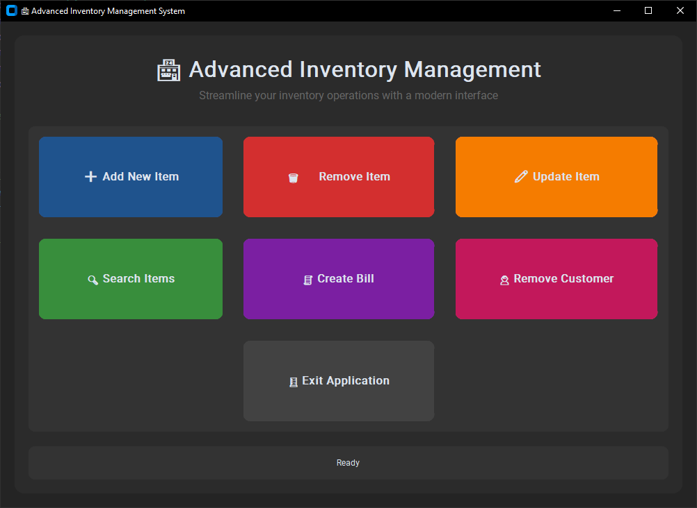
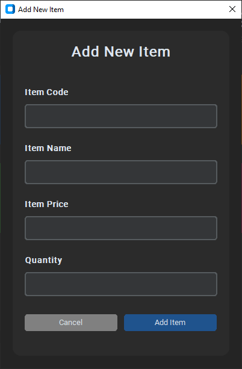
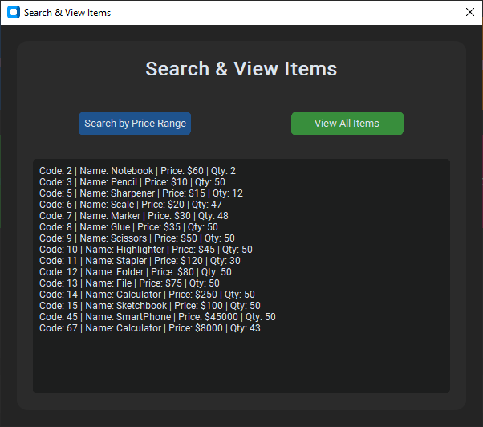
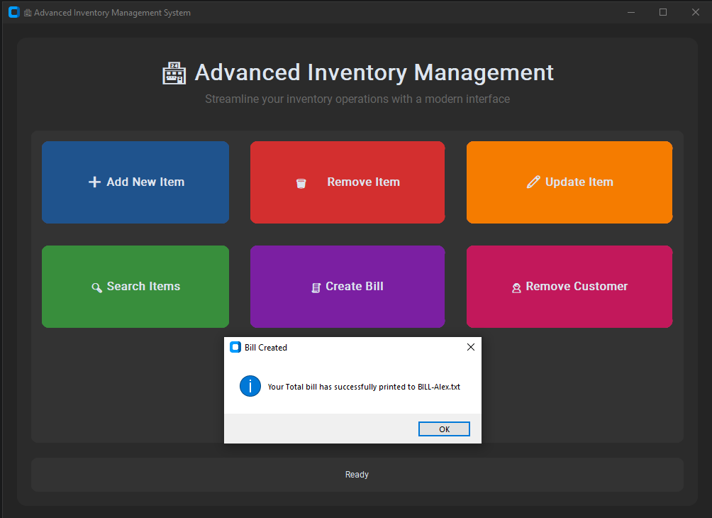

# 🏪 Advanced Inventory Management System

## Project Overview
This project is a modern, user-friendly inventory control system developed with Python and the CustomTkinter library for its Graphical User Interface (GUI). It allows for efficient management of inventory items and customer data, providing a streamlined experience for businesses or personal use.

## Features
-   **Add New Item:** Easily add new products to the inventory with details like code, name, price, and quantity.
-   **Remove Item:** Remove existing items from the inventory using their unique item code.
-   **Update Item:** Modify item details (name, price, quantity) for existing products.
-   **Search & View Items:**
    -   Search for items within a specific price range.
    -   View a comprehensive list of all items currently in stock.
-   **Create Bill:** Generate detailed bills for customers, updating stock levels automatically.
-   **Customer Management:** Register new customers and remove existing customer records.
-   **Intuitive GUI:** Built with CustomTkinter for a modern, responsive, and aesthetically pleasing user interface.
-   **Data Persistence:** Item and customer data are saved to local text files (`DATA.txt`, `customerData.txt`) for persistent storage.

## Technologies Used
-   **Python 3.x**
-   **CustomTkinter:** For building the modern graphical user interface.
-   **Standard Python Libraries:** `tkinter`, `messagebox`, `simpledialog`, `os`, `datetime`, `PIL` (Pillow for image handling, though currently not heavily used, good to list if planned), `threading` (if multi-threading is intended for future features).

## Getting Started

### Prerequisites
-   Python 3.x installed on your system.

### Installation
1.  **Clone the repository:**
    ```bash
    git clone [https://github.com/sanugaFDO/Inventory-System-with-CustomTkinter.git]
    cd Inventory-Control-System-GUI
    ```

2.  **Install dependencies:**
    ```bash
    pip install -r requirements.txt
    ```

### How to Run
After installation, run the main application script:
```bash
python modern_gui.py
```

## Usage Screenshots

Here are some screenshots of the Inventory Management System in action:

### Main Application Window


### Add Item Dialog


### Search Results


### Create Bills


### File Structure

```
.
├── modern_gui.py         # Main application script with CustomTkinter GUI logic
├── DATA.txt              # Stores inventory item data (Code#Name#Price#Quantity)
├── customerData.txt      # Stores customer registration data
├── requirements.txt      # Lists Python dependencies (CustomTkinter)
├── .gitignore            # Specifies intentionally untracked files to ignore
└── README.md             # Project documentation (this file)
